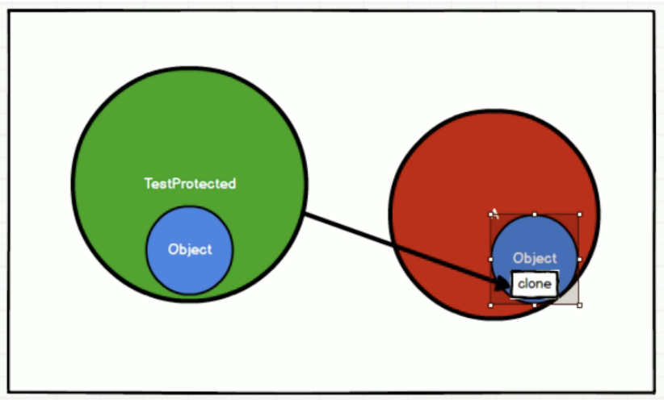
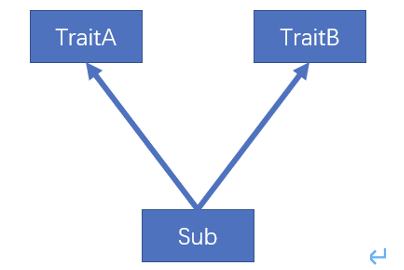
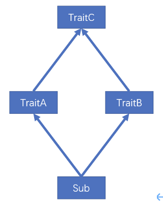
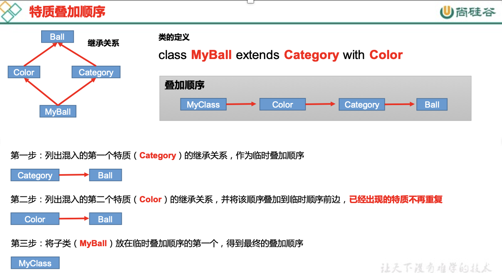
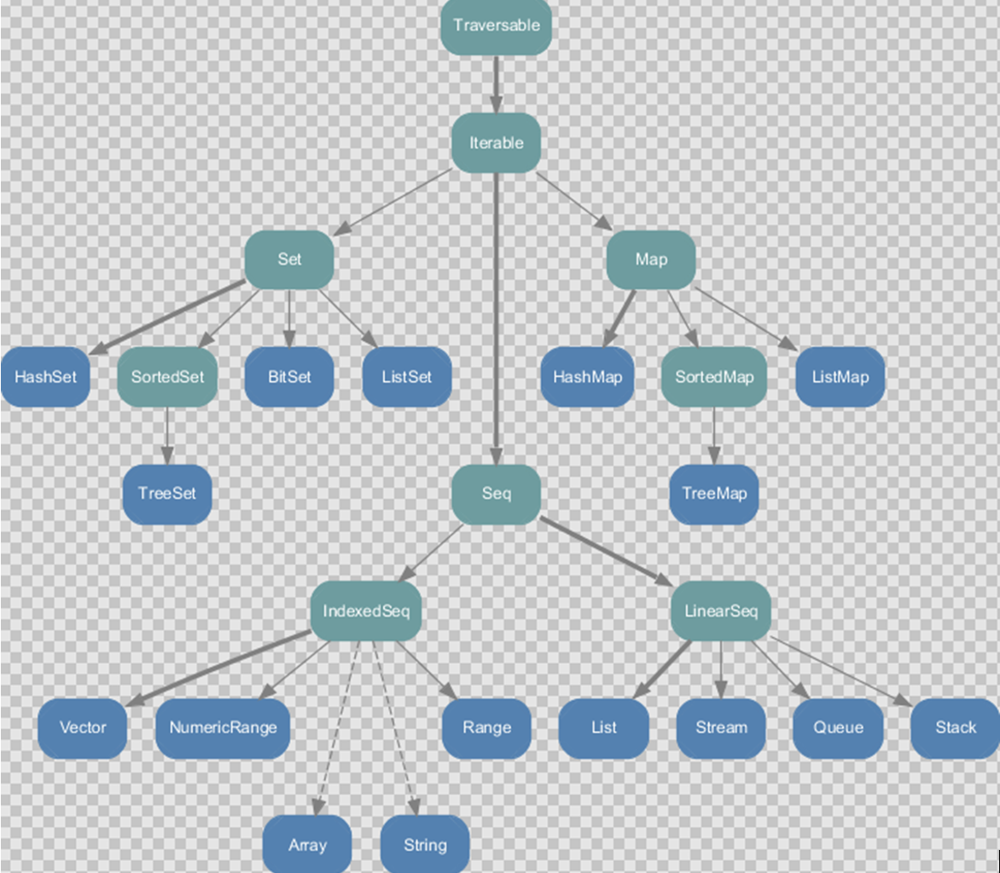
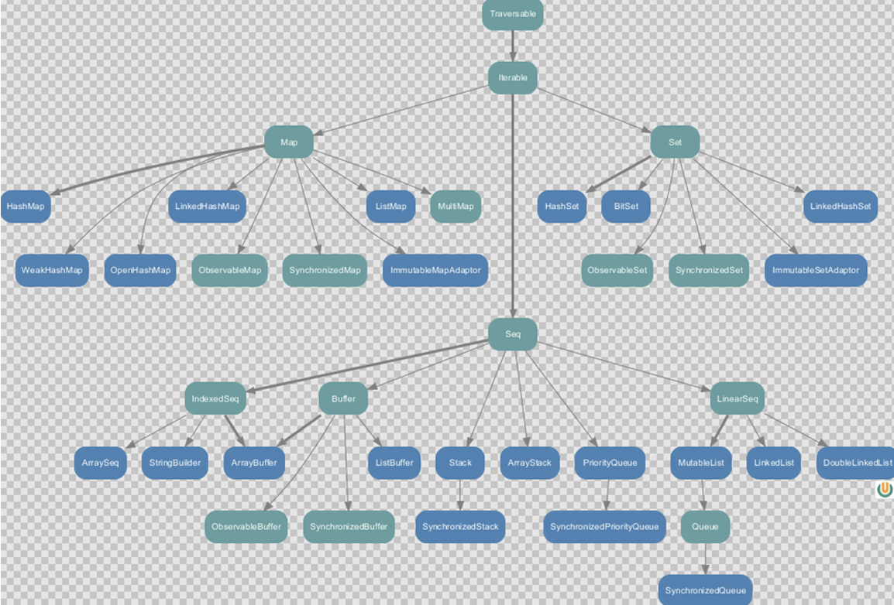

# Scala 入门
## 变量和常量

```scala
var 变量名 [: 变量类型] = 初始值
val 常量名 [: 常量类型] = 初始值
```

1. 声明变量时，类型可以省略，编译器自动推导，即类型推导
2. 类型确定后，就不能修改，说明 scala 是强数据类型语言
3. 变量声明时，必须要有初始值
4. 在声明/定义一个变量时，可以使用var或者val来修饰，var 修饰的变量可改变，val 修饰的变量不可改
5. var修饰的对象引用可以改变，val修饰的对象则不可改变，但对象的状态（值）却是可以改变的。（比如：自定义对象、数组、集合等等）


## 字符串输出
```scala
//（1）字符串，通过 + 号连接
val s1 = name + " " + age
//（2）printf用法字符串，通过 % 传值
printf("name=%s age=%d\n", name, age)
//（3）字符串，通过 $ 引用
val s1 =
    s"""
        |select
        |    name,
        |    age
        |from user
        |where name="$name" and age=${age+2}
    """.stripMargin
```

## 键盘输入
```scala
import scala.io.StdIn
var name = StdIn.readLine()
var age = StdIn.readShort()
var sal = StdIn.readDouble()
```

## 数据类型
### Java 数据类型
1. java 基本类型：char、byte、short、int、long、float、double、boolean
2. java 引用类型：对象类型

由于 java 有基本类型，而且基本类型不是真正意义的对象，即使启面产生了基本类型的包装类，但是仍然存在基本数据类型，所以 java 语言并不是真正意思的面向对象。
java 基本类型的包装类: Character、Byte、Short、Integer、Long、Float、Double、Boolean
注意：java 中基本类型和引用类型没有共同的祖先。

### Scala 数据类型


1. scala 中一切数据都是对象，都是 Any 的子类
2. scala 中数据类型分为两大类：数值类型（AnyVal）、引用类型（AnyRef），不管是值类型还是引用类型都是对象
3. scala 数据类型仍然遵守低精度的值类型向高精度值类型自动转换（隐士转换）
4. scala 中的 StringOps 是对 java 中的 String 增强
5. Unit：表示无值，和其他语言中 void 等同。用作不返回任何结果的方法的结果类型。Unit只有一个实例值，写成 ()。void 不是数据类型，只是一个关键字
6. Null 是一个类型，它只有一个对象 null。 它是所有 AnyRef 类型的子类。Null可以赋值给任意引用类型（AnyRef），但是不能赋值给值类型（AnyVal）
7. Nothing 类型在 Scala 的类层级最低端；它是任何其他类型的子类型。当一个函数，我们确定没有正常的返回值，可以用 Nothing 来指定返回类型，这样有一个好处，就是我们可以把返回的值（异常）赋给其它的函数或者变量（兼容性）

### 整数类型
1. Byte [1]：8位有符号补码整数
2. Short [2]：16位有符号补码整数
3. Int [4]：32位有符号补码整数
4. Long [8]：64位有符号补码整数
5. scala 的整型，默认为 Int 型，声明 Long 型，须后加 ‘l’ 或 ‘L’

### 字符类型
字符类型可以表示单个字符，字符类型是 Char。字符常量是用单引号 ' ' 括起来的单个字符。

### 布尔类型
布尔类型也叫 Booolean 类型数据只允许取值 true 和 false，Booolean 类型占1个字节。

## 类型转换
### 数值类型自动转换
当Scala程序在进行赋值或者运算时，精度小的类型自动转换为精度大的数值类型，这个就是自动类型转换（隐式转换）。


1. 自动提升原则：有多种类型的数据混合运算时，系统首先自动将所有数据转换成精度大的那种数据类型，然后再进行计算
2. 把精度大的数值类型赋值给精度小的数值类型时，就会报错，反之就会进行自动类型转换
3. （byte，short）和char之间不会相互自动转换
4. byte，short，char他们三者可以计算，在计算时首先转换为int类型

### 强制类型转换
1. 将数据由高精度转换为低精度，就需要使用到强制转换
2. 强转符号只针对于最近的操作数有效，往往会使用小括号提升优先级
```scala
var num : Int = 2.7.toInt
```

### 数值类型和String类型间转换
1. 基本类型转String类型（语法：将基本类型的值+"" 即可）
2. String类型转基本数值类型（语法：s1.toInt、s1.toFloat、s1.toDouble、s1.toByte、s1.toLong、s1.toShort）
3. 在将String类型转成基本数值类型时，要确保String类型能够转成有效的数据

```scala
var str1 : String = true + ""
var n1 : Byte = s1.toByte
```

## 运算符
java 中 == 比较两个变量本身的值，即两个对象在内存中的首地址；equals 比较字符串中所包含的内容是否相同。
scala中 == 更加类似于 java 中的 equals

```scala
val s1 = "abc"
val s2 = new String("abc")
s1 == s2  // true
s1.eq(s2)  // false
```

在 scala 中其实是没有运算符的，所有运算符都是方法。
1. 当调用对象的方法时，点.可以省略
2. 如果函数参数只有一个，或者没有参数，() 可以省略

```scala
// 标准的加法运算
val i:Int = 1.+(1)
val j:Int = 1 + (1)
val k:Int = 1 + 1
```

## 流程控制
### 分支控制if-else
1. scala 中 if else 表达式其实是有返回值的，具体返回值取决于满足条件的代码体的最后一行内容
2. 如果大括号{}内的逻辑代码只有一行，大括号可以省略。如果省略大括号，if只对最近的一行逻辑代码起作用

### Switch分支结构
在 scala 中没有 Switch，而是使用模式匹配来处理

### For循环控制
1. for 推导式一行中有多个表达式时，所以要加 ; 来隔断逻辑
2. for 推导式有一个不成文的约定：当for推导式仅包含单一表达式时使用圆括号，当包含多个表达式时，一般每行一个表达式，并用花括号代替圆括号
3. 如果想倒序打印一组数据，可以用reverse
#### 范围数据循环（to）
```scala
for(i <- 1 to 3){
    print(i + " ")
}
```

#### 范围数据循环（until）
```scala
for(i <- 1 until 3) {
    print(i + " ")
}
```

#### 循环守卫
```scala
for(i <- 1 to 3 if i != 2) {
    print(i + " ")
}
```

#### 循环步长
```scala
for (i <- 1 to 10 by 2) {
    println("i=" + i)
}
```

#### 嵌套循环
```scala
for(i <- 1 to 3; j <- 1 to 3) {
    println(" i =" + i + " j = " + j)
}
```

#### 引入变量
```scala
for(i <- 1 to 3; j = 4 - i) {
    println("i=" + i + " j=" + j)
}
```

#### 循环返回值
将遍历过程中处理的结果返回到一个新 Vector 集合中，使用 yield 关键字，开发中很少使用
```scala
val res = for(i <- 1 to 10) yield i
```

#### 倒序打印
```scala
for(i <- 1 to 10 reverse){
    println(i)
}
```

### while 和 do..while 循环控制
与 if 语句不同，while 语句没有返回值，即整个 while 语句的结果是 Unit 类型()。因为 while 中没有返回值，所以当要用该语句来计算并返回结果时，就不可避免的使用变量，而变量需要声明在 while 循环的外部，那么就等同于循环的内部对外部的变量造成了影响，也就违背了函数式编程的重要思想（输入=>函数=>输出，不对外界造成影响），所以不推荐使用，而是推荐使用 for 循环。

### 循环中断
scala 内置控制结构特地去掉了 break 和 continue，是为了更好的适应函数式编程，推荐使用函数式的风格解决 break 和 continue 的功能，而不是一个关键字。scala 中使用 breakable 控制结构来实现 break 和 continue 功能。

```scala
import scala.util.control.Breaks._

def main(args: Array[String]): Unit = {
    breakable {
        for (elem <- 1 to 10) {
            println(elem)
            if (elem == 5) break
        }
    }
}
```


# 函数式编程
面向对象编程：解决问题，分解对象，行为，属性，然后通过对象的关系以及行为的调用来解决问题。对象的本质：对数据和行为的一个封装

函数式编程：解决问题时，将问题分解成一个一个的步骤，将每个步骤进行封装（函数），通过调用这些封装好的步骤，解决问题。函数的本质：函数可以当做一个值进行传递

## 函数基础
### 函数和方法的区别
1. 为完成某一功能的程序语句的集合，称为函数
2. scala 中函数可以嵌套定义
2. 类中的函数称之方法
3. 函数没有重载和重写的概念；方法可以进行重载和重写


### 函数至简原则
1. return 可以省略，scala 会使用函数体的最后一行代码作为返回值；如果有 return，则不能省略返回值类型，必须指定；如果函数明确声明 unit，那么即使函数体中使用 return 关键字也不起作用
2. 如果函数体只有一行代码，可以省略花括号
3. 返回值类型如果能够推断出来，那么可以省略（:和返回值类型一起省略）；scala 如果期望是无返回值类型，可以省略等号
4. 如果函数无参，但是声明了参数列表，那么调用时，小括号，可加可不加；如果函数没有参数列表，那么小括号可以省略，调用时小括号必须省略

```scala
// 可变参数
// 期望是无返回值类型，可以省略等号
def f1(s: String*) {println(s)}

// 省略返回值类型
def f2(i:Int) = i + 1
```

## 函数高级
### 高阶函数
1. 在被调用函数后面加上 _，相当于把函数当成一个整体，传递给变量
```scala
def f(): Int = {
    println("foo...")
    1
}
val f1: () => Int = f _
```

2. 函数可以作为参数进行传递
```scala
// 定义一个函数，函数参数还是一个函数签名
def f1(f: (Int, Int) => Int) = f(2, 4)

// 参数和返回值类型和f1的输入参数一致
def add(a: Int, b: Int) = a + b

// 将add函数作为参数传递给f1函数，如果能够推断出来不是调用，_可以省略
f1(add _) // 6
f1(add) // 6
```

3. 函数可以作为函数返回值返回
```scala
def f1() = {
    def f2() = {}

    f2 _
}

val f = f1()
// 因为f1函数的返回值依然为函数，所以可以变量f可以作为函数继续调用
f()
// 上面的代码可以简化为
f1()()
```
print 的参数是普通类型 (x: Any)，而函数是一个特殊的类型。print 不能传递函数，参数只能由别人传递，所以  _ 一定代表别人传递的参数，例如：array.foreach(print(_))，_ 一定代表 foreach 的参数，可以推断出来 x=>print(x)。否则没人提供，可以推断出来就可以省略。
map(_)，但是这里的 map 就不一定可以推断出来。map 的参数函数，是特殊类型。比如 map(f  _)，这里的 _ 就有歧义
1. f _ 是将 f 作为一个整体传入
2. _ 是 f 的一个参数
map(_*2) 可以，没有歧义，函数不可以*2，可以推断出 _ 代表参数，一定来源于 x=>x*2，此时可以省略


### 匿名函数
匿名函数至简原则
1. 匿名函数如果只有一行，则大括号也可以省略
2. 参数的类型可以省略，会根据形参进行自动的推导
3. 类型省略之后，发现只有一个参数，则圆括号可以省略；其他情况：没有参数和参数超过1的永远不能省略圆括号。
4. 如果参数只出现一次，则参数省略且后面参数可以用 _ 代替，第 n 个 _ 代表第 n 个参数

### 函数柯里化 & 闭包
闭包：如果一个函数，访问到了它的外部（局部）变量的值，那么这个函数和他所处的环境，称为闭包。闭包是函数式编程的标配

函数柯里化：把一个参数列表的多个参数，变成多个参数列表。其实就是将复杂的参数逻辑变得简单化,函数柯里化一定存在闭包
```scala
var a: Int = 10

def f1() = {
    def f2(b: Int) = a + b

    f2 _
}

// 在调用时，f1函数执行完毕后，局部变量a应该随着栈空间释放掉
// 但是在此处，变量a其实并没有释放，而是包含在了f2函数的内部，形成了闭合的效果
val f: Int => Int = f1()

f(3)   // 13
f1()(3)   // 13

// 函数柯里化，其实就是将复杂的参数逻辑变得简单化,函数柯里化一定存在闭包
def f3()(b: Int) = {
    a + b
}

f3()(3) // 13
```

### 控制抽象
控制抽象被描述为是一系列语句的聚集，是一种特殊的函数，因为它是本质上只是对一系列语句的封装。
1. 值调用：把计算后的值传递过去
2. 名调用：把代码传递过去

java 只有值调用；scala 既有值调用，又有名调用
```scala
def myShop(block: () => Unit) {
    println("Welcome in!")
    block()
}

// Welcome in!
// I want a pencil
// 将圆括号替换成花括号只能发生在接收一个参数值的函数上，如果某个函数接收的是两个参数，那么将圆括号改成花括号就会报错
// 圆括号与大括号的区别在于可以传递的代码量而已。圆括号只能传递一条语句，而大括号可以传递多条语句
myShop {
    () => println("I want a pencil")
}
```

```scala
// 可以理解为省略空参列表的简写方式
def myShop(block: => Unit) {
    println("Welcome in!")
    block
}

// Welcome in!
// I want a condom
myShop( println("I wanna buy a condom") )
```

### 惰性函数
当函数返回值被声明为lazy时，函数的执行将被推迟，直到我们首次对此取值，该函数才会执行。


# 面向对象
## Scala包
### 包说明
一个源文件中可以声明多个package，包名叠加。包名可以采用对象的方式嵌套（父子包），可以在包名的后面增加{}，表示作用域。其中{}里面可以声明包和类（无法声明属性和方法），子包访问父包无需导包
```scala
package com {
    import com.atguigu.Inner //父包访问子包需要导包
    object Outer {
        val out: String = "out"
        def main(args: Array[String]): Unit = {
            println(Inner.in)
        }
    }

    package atguigu {
        object Inner {
            val in: String = "in"
            def main(args: Array[String]): Unit = {
                println(Outer.out) //子包访问父包无需导包
            }
        }
    }
}
```

### 包对象
包中无法声明属性和方法，scala提供了包对象的概率，可以声明属性和方法。在Scala中可以为每个包定义一个同名的包对象，定义在包对象中的成员，作为其对应包下所有class和object的共享变量，可以被直接访问。
```scala
package object com{
	val shareValue="share"
	def shareMethod()={}
}
```

### 导包说明
1. 方法区内存溢出：加载了大量的类
2. 堆内存溢出：垃圾回收器回收对象之后，还没有足够的内存分配对象
3. 栈内存溢出：没有足够的内存来分配这个栈空间。java 中来一个线程会给一个栈内存，线程很多的情况下，栈会很多，栈就有可能分配不了，会导致栈内存溢出
4. 递归调用会出现栈溢出 StackOverflow（滚动条），压栈次数不够（里面的小格子不够）

```scala
import java.util._  // 导入包中所有的类
import java.util.{ArrayList=>JL}    // 给类起名
import java.util.{ArrayList =>_,_}  // 屏蔽类
import java.util.{HashSet, ArrayList}   // 导入多个类
```

scala中的三个默认导入分别是
```scala
import java.lang._
import scala._
import scala.Predef._
```

### 访问权限
1. scala 中属性和方法的默认访问权限为 public，但 scala 中无 public 关键字
2. private 为私有权限，只在类的内部和伴生对象中可用
3. protected 为受保护权限，scala 中受保护权限比 java 中更严格，同类、子类可以访问，同包无法访问（和 java 区别）
4. private[包名] 增加包访问权限，包名下的其他类也可以使用

```java
public class TestProtected {
    public static void main(String[] args) throws Exception {
        A a = new A();
        a.clone();	// 为什么子类 TestProtected 无法访问父类 Object 中的 clone() ?
    }
}

class A {
}
```
1. 一个类继父类所有内容（包括私有），访问权限表示你能不能用，和有没有没关系
2. 子类可以代替父类出现（因为子类包含父类内存中所有内容）
3. 访问权限：方法的提供者和方法的调用者之间的关系
4. “.” 表示从属关系，user.name = 用户中 的name 属性
5. 方法的提供者：java.lang.Object
6. 方法的调用者：com.atguigu.bigdata.java.TestProtected



```java
public class TestProtected {
    public static void main(String[] args) throws Exception {
        A a = new A();
        a.clone();	// A中重写clone()方法，为什么能访问 ？
    }
}

class A {
    @Override
    protected Object clone() throws CloneNotSupportedException {
        return super.clone();
    }
}
```
1. 方法的提供者：com.atguigu.bigdata.java.A
2. 方法的调用者：com.atguigu.bigdata.java.TestProtected
3. A中重写clone()方法，clone()的提供者就发生改变，提供者和调用者属于同包，可以访问


## 类和对象
静态和类有关系，和对象无关。Scala中没有静态，Scala是一个完全面向对象的语言
```java
Thread t1 = new Thread();
Thread t2 = new Thread();

t1.start();
t2.start();

t1.sleep(1000); // Thread static method
t2.wait();  // Object member method
```
1. sleep() 不会让 t1 对象休眠，和它无关。正确写法：Thread.sleep(1000)，让当前正在运行的线程休眠，如果是在 main 方法中调用，则是主线程休眠
2. wait() 是一个成员方法，和对象相关，意味着和 t2 有关系，则 t2 等待

### 类
1. scala 语法中，类并不声明为 public，所有这些类都具有公有可见性（即默认就是 public）
2. 一个 scala 源文件可以包含多个类

### 属性
java 中的 String 是不可变字符串，s.strim()会产生新的字符串，对原来的字符串没有任何影响。
```java
public final class String{
    private final char value[];
}
```
1. 引用类型的值是内存地址，final修饰之后无法改变，内容可变。不可变字符串中的不可变指的是内存地址
2. 但是 String 没有提供任何的方法来改变它的内容，所以它的所有方法是产生新的字符串，例如replace()、substring()
3. 为了满足 bean 规范，使用注解 @BeanProperty 给 bean 增加 set、get 方法
```scala
// 基本语法
[修饰符] var|val 属性名称 [：类型] = 属性值
```
1. 类声明的属性，其实编译成字节码文件时，声明私有的属性。同时，scala编译器会给属性生成两个公共访问的方法（类似set、get）
2. 如果使用 val 声明类的属性，会给这个属性同时增加 final，不会在编译时产生属性对应的 set 方法
3. 类的属性如果声明为private，那么对应的set、get方法也是私有的
4. scala 中访问对象的属性，其实不是访问属性，而是属性对应的方法。调用属性等同于调用属性的 get 方法、给属性赋值等同于调用属性的 set 方法
5. Bean 属性（@BeanProperty），可以自动生成规范的 setXxx/getXxx 方法

### 方法
#### 重写
```java
public class Test {
    public static void main(String[] args) {
        A a = new B();
        a.getSum();	// 30
    }
}

class A {
    public int i = 10;

    public int getSum() {
        return getI() + 10;
    }

    public int getI() {
        return i;
    }
}

class B extends A {
    public int i = 20;

    public int getI() {
        return i;
    }
}
```
1. 多态：子类重写父类方法
2. 调用的原则：动态绑定机制
3. 调用对象的成员方法时（无论是直接调用还是间接调用，只要调用成员方法），会将方法和当前对象的实际内存进行绑定，然后调用。动态绑定机制和属性无关，意味着看属性的时候不会看实际内存（变量在哪声明在哪使用，属性不是动态绑定的）

#### 重载
```java
public class TestProtected {
    public static void main(String[] args) {
        A a = new B();
        testA(a);   // A
    }

    public static void testA(A a) {
        System.out.println('A');
    }

    public static void testA(B b) {
        System.out.println('B');
    }
}

class A {
}

class B extends A {
}
```
1. 重载：参数列表不相同：参数个数、参数顺序、参数类型
2. 不看实际内存，只看参数类型

### 创建对象
```scala
val | var 对象名 [：类型]  = new 类型()
```
1. scala构造方法如果无参，可以省略小括号
2. val 修饰对象，不能改变对象的引用（即：内存地址），可以改变对象属性的值
3. var修饰对象，可以修改对象的引用和修改对象的属性值

### 构造器
scala 类的构造器包括：主构造器和辅助构造器

类也是函数，可以在类名后加 ()。类名后如果加 ()，表示的就是主构造方法。{} 里面的内容就是构造方法体，构造对象的时候，里面的代码都可以执行
```scala
class 类名(形参列表) {  // 主构造器
   // 类体
   def  this(形参列表) {  //辅助构造器可以有多个...
   }
} 
```
1. 辅助构造器，函数的名称 this，可以有多个，编译器通过参数的个数来区分
2. 辅助构造方法不能直接构建对象，必须直接或者间接调用主构造方法
3. 构造器调用其他另外的构造器，要求被调用构造器必须提前声明

### 构造器参数
scala类的主构造器函数的形参包括三种类型：未用任何修饰、var修饰、val修饰
1. 未用任何修饰符修饰，这个参数就是一个局部变量
2. var修饰参数，作为类的成员属性使用，可以修改
3. val修饰参数，作为类只读属性使用，不能修改

## 封装
scala 中的 public 属性，底层实际为 private，并通过 get 方法（obj.field()）和 set 方法（obj.field_=(value)）对其进行操作。所以 scala 并不推荐将属性设为 private，再为其设置 public 的 get 和 set 方法的做法。但由于很多 java 框架都利用反射调用 getXXX 和 setXXX 方法，有时候为了和这些框架兼容，也会为 scala 的属性设置 getXXX 和 setXXX 方法（通过 @BeanProperty 注解实现）。


## 继承
1. 子类继承父类的属性和方法（全部，能不能用和访问权限有关系）
2. 继承的调用顺序：父类构造器 -> 子类构造器
```scala
object Test extends App {
    // A
    // B
    // B this
    new B()
}

class A(var s: String) {
    println("A")

    def this() {
        this("")
        println("A this")
    }
}

class B(s: String) extends A(s) {
    println("B")

    def this() {
        this("")
        println("B this")
    }
}
```

```scala
object Test extends App {
    // A
    // A this
    // B
    // B this
    new B()
}

class A(var s: String) {
    println("A")

    def this() {
        this("")
        println("A this")
    }
}

class B(s: String) extends A {
    println("B")

    def this() {
        this("")
        println("B this")
    }
}
```

## 抽象属性和抽象方法
### 抽象属性和抽象方法
```scala
abstract class Person{} // 通过abstract关键字标记抽象类
val|var name:String // 一个属性没有初始化，就是抽象属性;所谓的属性抽象，其实编译时没有属性，只有抽象的类set、get方法，所以类必须为抽象的
def hello():String // 只声明而没有实现的方法，就是抽象方法
```

### 继承 & 重写
1. 如果父类为抽象类，那么子类需要将抽象的属性和方法实现，否则子类也需声明为抽象类
2. 重写非抽象方法、非抽象属性需要用 override 修饰，重写抽象方法则可以不加 override
3. 子类中调用父类的方法使用 super 关键字
4. 具体的属性（非抽象属性）如果要重写，必须声明为不可变 val，而不支持 var。scala 中属性和方法都是动态绑定，而 java 中只有方法为动态绑定（ java 运行时动态绑定针对的范畴只是对象的方法）
```java
class Person {
    public String name = "person";

    public void hello() {
        System.out.println("hello person");
    }
}

class Teacher extends Person {
    public String name = "teacher";

    @Override
    public void hello() {
        System.out.println("hello teacher");
    }
}

public class TestDynamic {
    public static void main(String[] args) {
        Person teacher = new Teacher();
        System.out.println(teacher.name);   // person
        teacher.hello();    // hello teacher
    }
}
```

```scala
class Person {
    val name: String = "person"

    def hello(): Unit = {
        println("hello person")
    }
}

class Teacher extends Person {
    override val name: String = "teacher"

    override def hello(): Unit = {
        println("hello teacher")
    }
}

object Test {
    def main(args: Array[String]): Unit = {
        val teacher1: Person = new Teacher
        println(teacher1.name)  // teacher
        teacher1.hello()    // hello teacher
    }
}
```

## 匿名子类
和 java 一样，可以通过包含带有定义或重写的代码块的方式创建一个匿名的子类
```scala
abstract class Person {
    val name: String
    def hello(): Unit
}

val person = new Person {
    override val name: String = "teacher"
    override def hello(): Unit = println("hello teacher")
}
```

## 单例对象（伴生对象）
java 构造方法私有化，使用公共静态返回本类型的方法。java 中的单例对象无法被回收，单例对象一般是通过静态访问，单例对象在方法区。方法区没有弹栈的概念，引用会一直在，对象不能称为无用对象。

scala 语言是完全面向对象的语言，所以并没有静态的操作（即在 scala 中没有静态的概念）。但是为了能够和 java 语言交互（因为 java 中有静态概念），就产生了一种特殊的对象来模拟类对象，该对象为单例对象。若单例对象名与类名一致，则称该单例对象这个类的伴生对象，这个类的所有“静态”内容都可以放置在它的伴生对象中声明。

### 单例对象语法
```scala
object Person {
    val country: String = "China"
}
```
1. 单例对象采用 object 关键字声明
2. 单例对象对应的类称之为伴生类，伴生对象的名称应该和伴生类名一致
3. 单例对象中的属性和方法都可以通过伴生对象名（类名）直接调用访问

### apply 方法
1. 通过伴生对象的 apply 方法，实现不使用 new 方法创建对象
2. 如果想让主构造器变成私有的，可以在 () 之前加上 private。如果在主构造方法前增加 private，那么外部无法创建对象。但是伴生类中的私有属性或方法在伴生对象中可以直接使用
3. apply 方法可以重载
4. scala 中 obj(arg) 的语句实际是在调用该对象的 apply 方法，即 obj.apply(arg)。用以同一面向对象编程和函数式编程的风格
5. 当使用 new 关键字构建对象时，调用的其实时类的构造方法，当直接使用类名构建对象时，调用的其实是伴生对象的 apply 方法
6. apply 方法使用的目的是用于创建对象，但是类型没有约束
```scala
// 在()之前加上private, 让主构造器变成私有
class Person private(name: String) {
    var name: String = name
}

object Person {
    def apply(): Person = {
        println("apply空参被调用")
        new Person("xx")  // 伴生类中的私有属性或方法在伴生对象中可以直接使用
    }

    def apply(name: String): Person = {
        println("apply有参被调用")
        new Person(name)
    }
}
```

## 特质（Trait）
scala 语言中，采用特质 trait（特征）来代替接口的概念，也就是说，多个类具有相同的特征（特征）时，就可以将这个特质（特征）独立出来，采用关键字trait声明。

scala 中的 trait 中即可以有抽象属性和方法，也可以有具体的属性和方法，一个类采用 extends 关键字完成特征的引入（混入）。特征在编译时会自动产生接口，在类中混入特质时，等同于实现接口。特征中可以声明具体的方法，此时编译后会产生对应的抽象类。

### 特质基本语法
```scala
trait 特质名 {
    trait体
}
```
1. 类和特质的关系：使用继承的关系
2. 当一个类去继承特质时，第一个连接词是 extends，后面是 with
3. 如果一个类在继承特质和父类时，应当把父类写在 extends 后
4. 特质可以同时拥有抽象方法和具体方法
5. 一个类可以混入（mixin）多个特质
6. 所有的Java接口都可以当做 scala 特质使用
7. 动态混入：可灵活的扩展类的功能
```scala
trait SexTrait {
    var sex: String
}

val t2 = new Teacher with SexTrait {
    override var sex: String = "男"	// 如果混入的trait中有未实现的方法，则需要实现
}
```

### 特质叠加
由于一个类可以混入（mixin）多个 trait，且 trait 中可以有具体的属性和方法，若混入的特质中具有相同的方法（方法名，参数列表，返回值均相同），必然会出现继承冲突问题。

第一种，一个类（Sub）混入的两个 trait（TraitA，TraitB）中具有相同的具体方法，且两个 trait 之间没有任何关系，解决这类冲突问题，直接在类（Sub）中重写冲突方法。



第二种，一个类（Sub）混入的两个 trait（TraitA，TraitB）中具有相同的具体方法，且两个 trait 继承自相同的 trait（TraitC），解决这类冲突问题，Scala采用了特质叠加的策略。



```scala
trait Ball {
    def describe(): String = {
        "ball"
    }
}

trait Color extends Ball {
    override def describe(): String = {
        "blue-" + super.describe()
    }
}

trait Category extends Ball {
    override def describe(): String = {
        "foot-" + super.describe()
    }
}

class MyBall extends Category with Color {
    override def describe(): String = {
        "my ball is a " + super.describe()
    }
}

object TestTrait {
    def main(args: Array[String]): Unit = {
        println(new MyBall().describe())    // my ball is a blue-foot-ball
    }
}
```


1. 如果父类和特质同时存在，那么会先加载父类，再加载特征
2. 多个特质的加载顺序为从左到右，多个特质混入时，调用方法从右到左
3. super 关键字时动态绑定的，不是表示其父特质对象，而是表示上述叠加顺序中的下一个特质，即，MyBall 中的 super 指代 Color，Color 中的 super 指代 Category，Category 中的 super 指代Ball
4. 如果想要调用某个指定的混入特质中的方法，可以增加约束：super[]，例如：super[Category].describe()



## 扩展
### 类型检查和转换
```scala
class Person {}

object Person {
    def main(args: Array[String]): Unit = {
        val person = new Person
        //（1）判断对象是否为某个类型的实例
        val bool: Boolean = person.isInstanceOf[Person]

        if (bool) {
            //（2）将对象转换为某个类型的实例
            val p1: Person = person.asInstanceOf[Person]
            println(p1)
        }

        //（3）获取类的信息
        val pClass: Class[Person] = classOf[Person]
        println(pClass)
    }
}
```

### 枚举类
```scala
object Color extends Enumeration {
    val RED = Value(1, "red")
    val YELLOW = Value(2, "yellow")
    val BLUE = Value(3, "blue")
}

object Test {
    def main(args: Array[String]): Unit = {
        println(Color.RED)  // red
    }
}
```

### 应用类
```scala
object Test extends App {
    println("xxx")	// xxx
}
```

### Type 定义新类型
使用 type 关键字可以定义新的数据数据类型名称，本质上就是类型的一个别名
```scala
type S=String
var v:S="abc"
def test():S="xyz"
```

# 集合
## 集合简介
1. scala 的集合有三大类：序列 Seq、集 Set、映射 Map，所有的集合都扩展自 Iterable 特质
2. 对于几乎所有的集合类，Scala 都同时提供了可变和不可变的版本，分别位于两个包
3. scala 不可变集合，就是指该集合对象不可修改，每次修改就会返回一个新对象，而不会对原对象进行修改。类似于 Java 中的 String 对象
4. 可变集合，就是这个集合可以直接对原对象进行修改，而不会返回新的对象。类似于 Java 中的 StringBuilder 对象
5. 不可变集合: scala.collection.immutable
6. 可变集合: scala.collection.mutable

### 不可变集合继承图



1. IndexSeq 是通过索引来查找和定位，因此速度快，比如 String 就是一个索引集合，通过索引即可定位；for 循环有也是 IndexedSeq 下的 Vector
2. LineaSeq是线型的，即有头尾的概念，这种数据结构一般是通过遍历来查找
3. scala 中的 Map 体系有一个 SortedMap，说明 scala 的 Map 可以支持排序

### 可变集合继承图



## 数组
### 不可变数组
```scala
val arr = Array[Int](1, 2, 3, 4)

// 增加数据，但是会产生新的集合
// 向数组最后追加数据
arr.:+(5) // Array(1, 2, 3, 4, 5)
arr :+ 5 // Array(1, 2, 3, 4, 5)
// 向数组前面追加数据，运算符以 : 结尾，那么调用顺序从后往前
arr.+:(5) // Array(5, 1, 2, 3, 4)
5 +: arr // Array(5, 1, 2, 3, 4)

// 增加其他集合中的所有元素
arr.++(Array(4, 5)) // Array(1, 2, 3, 4)
arr ++ Array(4, 5) // Array(1, 2, 3, 4)
```

### 可变数组
ArrayBuffer需要引入scala.collection.mutable.ArrayBuffer，ArrayBuffer是有序的集合。
```scala
val buffer = ArrayBuffer[Int]()
// 增加数据，改变的是底层数据结构
// 向数组最后追加数据
buffer.append(1, 2, 3, 4) // ArrayBuffer(1, 2, 3, 4)
// 向指定的位置插入数据
buffer.insert(3, 5, 6, 7) // ArrayBuffer(1, 2, 3, 5, 6, 7, 4)

// 根据索引删除多少个数据
buffer.remove(1) //ArrayBuffer(1, 3, 5, 6, 7, 4)
buffer.remove(2, 3) // ArrayBuffer(1, 3, 4)

// 修改数据
buffer.update(0, 5) //  ArrayBuffer(5, 3, 4)
buffer(0) = 10 // ArrayBuffer(10, 3, 4)
```

### 多维数组
```scala
val arr = Array.ofDim[Double](3,4)	// 二维数组中有三个一维数组，每个一维数组中有四个元素
```
### 不可变数组与可变数组的转换
```scala
arr.toBuffer	// 返回结果才是一个可变数组，arr 本身没有变化
buffer.toArray	// 返回结果才是一个不可变数组，buffer 本身没有变化
```

## Seq 集合（List）
### 不可变 List
```scala
// 空集合 Nil，用来增加数据

val list = 1 :: 2 :: 3 :: 4 :: Nil // List(1, 2, 3, 4)

// 增加数据
list.::(5) // List(5, 1, 2, 3, 4)
5 :: list // List(5, 1, 2, 3, 4)

val list1 = List(5, 6)
// 集合作为一个整体合并
list :: list1 // List(List(1, 2, 3, 4), 5, 6)

// 将一个整体拆成一个一个的个体来使用的方式，称为扁平化
list.++(list1) // List
list ::: list1 // List(1, 2, 3, 4, 5, 6)
```

### 可变 ListBuffer

## Set集合
默认情况下，Scala使用的是不可变集合，如果你想使用可变集合，需要引用 scala.collection.mutable.Set 包

### 不可变Set
1. Set默认是不可变集合，数据无序
2. 数据不可重复

### 可变mutable.Set
```scala
val set = mutable.Set(2, 1, 2) // Set(1, 2)

// 集合添加元素
set.add(3) // Set(1, 2, 3)
set += 8 // Set(1, 2, 3, 8)

// 向集合中添加元素，返回一个新的Set，本身没有变化
set.+(9) // Set(9, 1, 2, 3, 8)

// 删除数据
set -= 8 // Set(1, 2, 3)
set.remove(2) // Set(1, 3)
```

## Map集合
Scala中的Map和Java类似，也是一个散列表，它存储的内容也是键值对（key-value）映射，Scala中不可变的Map是有序的，可变的Map是无序的。

Scala 中 K-V 对声明方式为: K -> V
### 不可变Map
默认创建不可变集合Map

### 可变Map
```scala
val map = mutable.Map("a" -> 1, "b" -> 2, "c" -> 3) // Map(b -> 2, a -> 1, c -> 3)

// 增加数据: + 会创建新的 Map 集合，如果需要使用同一集合，那么使用 += 运算符
map.+("d" -> 4) // Map(b -> 2, a -> 1, c -> 3)
map.+=("d" -> 4) // Map(b -> 2, d -> 4, a -> 1, c -> 3)
map += ("e" -> 5) // Map(e -> 5, b -> 2, d -> 4, a -> 1, c -> 3)

// 删除数据: + 会创建新的 Map 集合，如果需要使用同一集合，那么使用 += 运算符
map.-("e") // Map(e -> 5, b -> 2, d -> 4, a -> 1, c -> 3)
map.-=("e") // Map(b -> 2, d -> 4, a -> 1, c -> 3)
map -= "d" // Map(b -> 2, a -> 1, c -> 3)

// 查询
// 使用get访问map集合的数据，会返回特殊类型Option(选项):有值（Some），无值(None)
map.get("d") // None
map.get("a") // Some(1)
map.getOrElse("d", 0) // 0
// map("d") // 如果查询不到指定的 key，会发生异常 NoSuchElementException
```

## 元组
元组也是可以理解为一个容器，可以存放各种相同或不同类型的数据。说的简单点，就是将多个无关的数据封装为一个整体，称为元组。元组中最大只能有22个元素。
```scala
val tuple: (Int, String, Boolean) = (40, "bo", true)

tuple._1 // 通过元素的顺序进行访问，调用方式：_顺序号
tuple.productElement(0) // 通过索引访问数据
for (elem <- tuple.productIterator) {
    println(elem) // 通过迭代器访问数据
}
```

```scala
// Map中的键值对其实就是元组,只不过元组的元素个数为2，称之为对偶
val map = Map("a" -> 1, "b" -> 2, "c" -> 3)

map.foreach(tuple => {
    println(tuple._1 + "=" + tuple._2)
})
```

## 集合常用函数
### 基本属性和常用操作
```scala
val list: List[Int] = List(1, 2, 3, 4, 5, 6, 7)
```
#### 获取集合长度
```scala
list.length    // 7
```

#### 获取集合大小
```scala
list.size    // 7
```

#### 循环遍历
```scala
list.foreach(println)
```

#### 迭代器
```scala
for (elem <- list.iterator) {
    println(elem)
}
```

#### 生成字符串
```scala
list.mkString(",") // 1,2,3,4,5,6,7
```

#### 是否包含
```scala
list.contains(3)   // true
```

### 衍生集合
```scala
val list1: List[Int] = List(1, 2, 3, 4, 5, 6, 7)
val list2: List[Int] = List(4, 5, 6, 7, 8, 9, 10)
```
#### 获取集合的头
```scala
list1.head // 1
```
#### 获取集合的尾（不是头的就是尾）
```scala
list1.tail // List(2, 3, 4, 5, 6, 7)
```
#### 集合最后一个数据
```scala
list1.last // 7
```
#### 集合初始数据（不包含最后一个）
```scala
list1.init // List(1, 2, 3, 4, 5, 6)
```
#### 反转
```scala
list1.reverse // List(7, 6, 5, 4, 3, 2, 1)
```
#### 取前（后）n个元素
```scala
list1.take(3) // List(1, 2, 3)
list1.takeRight(3) // List(5, 6, 7)
```
#### 去掉前（后）n个元素
```scala
list1.drop(3) // List(4, 5, 6, 7)
list1.dropRight(3) // List(1, 2, 3, 4)
```
#### 并集
```scala
list1.union(list2) // List(1, 2, 3, 4, 5, 6, 7, 4, 5, 6, 7, 8, 9, 10)
```
#### 交集
```scala
list1.intersect(list2) // List(4, 5, 6, 7)
```
#### 差集
```scala
list1.diff(list2) // List(1, 2, 3)
```
#### 拉链
```scala
list1.zip(list2) // List((1,4), (2,5), (3,6), (4,7), (5,8), (6,9), (7,10))
```
如果两个集合的元素个数不相等，那么会将同等数量的数据进行拉链，多余的数据省略不用
#### 滑窗
```scala
list1.sliding(2, 5).mkString(",") // List(1, 2),List(6, 7)
```

### 集合计算初级函数
```scala
val list = List(1, 5, -3, 4)
```
#### 求和
```scala
list.sum // 7
```
#### 求乘积
```scala
list.product // -60
```
#### 最大值
```scala
list.max // 5
```
#### 最小值
```scala
list.min // -3
```
#### 排序
```scala
list.sortBy(x => x)    // List(-3, 1, 4, 5)
list.sortBy(x => x.abs) // List(1, -3, 4, 5)
list.sortWith((x, y) => x < y) // List(-3, 1, 4, 5)
list.sortWith((x, y) => x > y) // List(5, 4, 1, -3)
```

### 集合计算高级函数
```scala
val list: List[Int] = List(1, 2, 3, 4, 5, 6, 7, 8, 9)
val nestedList: List[List[Int]] = List(List(1, 2, 3), List(4, 5, 6), List(7, 8, 9)
val wordList: List[String] = List("hello world", "hello scala")
```
#### 过滤
```scala
list.filter(x => x % 2 == 0) // List(2, 4, 6, 8)
```
#### 转化/映射
```scala
list.map(x => x + 1) // List(2, 3, 4, 5, 6, 7, 8, 9, 10)
```
#### 扁平化
```scala
nestedList.flatten // List(1, 2, 3, 4, 5, 6, 7, 8, 9)
```
#### 扁平化+映射：
flatMap相当于先进行map操作，在进行flatten操作
```scala
wordList.flatMap(x => x.split(" ")) // List(hello, world, hello, scala)
```
#### 分组
```scala
list.groupBy(x => x % 2) // Map(1 -> List(1, 3, 5, 7, 9), 0 -> List(2, 4, 6, 8)
```
#### 简化（规约）
Reduce方法通过指定的逻辑将集合中的数据进行聚合，从而减少数据，最终获取结果。
```scala
val list = List(1, 2, 3, 4)
list.reduce((x, y) => x - y) // -8
list.reduceRight((x, y) => x - y) // ((4-3)-2-1) = -2
```
从源码的角度，reduce底层调用的其实就是reduceLeft
#### 折叠
Fold折叠是化简的一种特殊情况。fold方法使用了函数柯里化，存在两个参数列表。第一个参数列表为零值（初始值）
```scala
val list = List(1, 2, 3, 4)

list.foldLeft(1)((x, y) => x - y) // -9
list.foldRight(10)((x, y) => x - y) // 8
```

```scala
// 两个Map的数据合并
val map1 = mutable.Map("a" -> 1, "b" -> 2, "c" -> 3)
val map2 = mutable.Map("a" -> 4, "b" -> 5, "d" -> 6)

// Map(b -> 7, d -> 6, a -> 5, c -> 3)
val map3 = map2.foldLeft(map1) {
    (map, kv) => {
        val (k, v) = kv
        map(k) = map.getOrElse(k, 0) + v
        map
    }
}
```
fold底层其实为foldLeft

### 队列
Scala也提供了队列（Queue）的数据结构，队列的特点就是先进先出。进队和出队的方法分别为enqueue和dequeue。
```scala
val que = new mutable.Queue[String]()

que.enqueue("a", "b", "c")
que.dequeue() // a
que.dequeue() // b
```


# 模式匹配
scala 中的模式匹配类似于 java 中的 switch 语法，但是更加强大。模式匹配语法中，采用match关键字声明，每个分支采用 case 关键字进行声明，当需要匹配时，会从第一个 case 分支开始，如果匹配成功，那么执行对应的逻辑代码，如果匹配不成功，继续执行下一个分支进行判断。如果所有 case 都不匹配，那么会执行 case _ 分支，类似于 java 中 default 语句。

## 基本语法
1. 如果所有 case 都不匹配，那么会执行 case _  分支，类似于 java 中 default 语句，若没有 case _ 分支，那么会抛出 MatchError
2. 每个case中，不用break语句，自动中断case
3. match case语句可以匹配任何类型，而不只是字面量
4. => 后面的代码块，是作为一个整体执行，可以使用{}括起来，也可以不括

## 模式匹配类型
### 匹配常量
Scala中，模式匹配可以匹配所有的字面量，包括字符串，字符，数字，布尔值等等。
```scala
var a: Int = 10
var b: Int = 20
var operator: Char = 'd'

var result = operator match {
    case '+' => a + b
    case '-' => a - b
    case '*' => a * b
    case '/' => a / b
    case _ => "illegal"  
}
```

### 匹配类型
需要进行类型判断时，可以使用前文所学的isInstanceOf[T]和asInstanceOf[T]，也可使用模式匹配实现同样的功能。
```scala
def describe(x: Any) = x match {
    case i: Int => "Int"
    case s: String => "String hello"
    case m: List[_] => "List"
    case c: Array[Int] => "Array[Int]"
    case someThing => "something else " + someThing
}
```

### 模式守卫
如果想要表达匹配某个范围的数据，就需要在模式匹配中增加条件守卫。
```scala
def abs(x: Int) = x match {
    case i: Int if i >= 0 => i
    case j: Int if j < 0 => -j
    case _ => "type illegal"
}
```

### 匹配数组
scala模式匹配可以对集合进行精确的匹配，例如匹配只有两个元素的、且第一个元素为0的数组。
```scala
val result = arr match {
    case Array(0) => "0" //匹配Array(0) 这个数组
    case Array(x, y) => x + "," + y //匹配有两个元素的数组，然后将将元素值赋给对应的x,y
    case Array(0, _*) => "以0开头的数组" //匹配以0开头和数组
    case _ => "something else"
}
```

### 匹配列表
```scala
val result = list match {
    case List(0) => "0" //匹配List(0)
    case List(x, y) => x + "," + y //匹配有两个元素的List
    case List(0, _*) => "0 ..."
    case _ => "something else"
}
```
```scala
val list = List(1, 2, 5, 6, 7)
list match {
    case first :: second :: rest => println(first + "-" + second + "-" + rest)  // 1-2-List(5, 6, 7)
    case _ => println("something else")
}
```

### 匹配元组
```scala
val result = tuple match {
    case (0, _) => "0 ..." //是第一个元素是0的元组
    case (y, 0) => "" + y + "0" // 匹配后一个元素是0的对偶元组
    case (a, b) => "" + a + " " + b
    case _ => "something else" //默认
}
```

### 匹配对象及样例类
#### 样例类
```scala
case class Person (name: String, age: Int)
```

```scala
def unapply(user: User): Option[(String, Int)] = {
    if (user == null)
        None
    else
        Some(user.name, user.age)
}
```

1. 样例类仍然是类，和普通类相比，只是其自动生成了伴生对象，并且伴生对象中自动提供了一些常用的方法，如apply、unapply、toString、equals、hashCode和copy
2. 样例类是为模式匹配而优化的类，因为其默认提供了unapply方法，因此，样例类可以直接使用模式匹配，而无需自己实现unapply方法
3. 构造器中的每一个参数都成为val，除非它被显式地声明为var（不建议这样做）
4. 若只提取对象的一个属性，则提取器为unapply(obj:Obj):Option[T]
5. 若提取对象的多个属性，则提取器为unapply(obj:Obj):Option[(T1,T2,T3…)]
6. 若提取对象的可变个属性，则提取器为unapplySeq(obj:Obj):Option[Seq[T]]

#### 匹配对象
```scala
case class User(name: String, age: Int) {}

val user: User = User("zhangsan", 11)
val result = user match {
    case User("zhangsan", 11) => "yes"
    case _ => "no"
}
```
1. val user = User("zhangsan",11)，该语句在执行时，实际调用的是User伴生对象中的apply方法，因此不用new关键字就能构造出相应的对象。
2. 当将User("zhangsan", 11)写在case后时[case User("zhangsan", 11) => "yes"]，会默认调用unapply方法(对象提取器)，user作为unapply方法的参数，unapply方法将user对象的name和age属性提取出来，与User("zhangsan", 11)中的属性值进行匹配
3. case中对象的unapply方法(提取器)返回Some，且所有属性均一致，才算匹配成功,属性不一致，或返回None，则匹配失败。

### 变量声明中的模式匹配
```scala
case class Person(name: String, age: Int)

val (x, y) = (1, 2) // x=1,y=2
val Array(first, second, _*) = Array(1, 7, 2, 9)    // first=1,second=7
val Person(name, age) = Person("zhangsan", 16)  // name=zhangsan,age=16
```

### for表达式中的模式匹配
```scala
val map = Map("A" -> 1, "B" -> 0, "C" -> 3)

for ((k, v) <- map) {
    println(k + "->" + v) // A->1、B->0、c->3
}

for ((k, 0) <- map) {
    println(k + "->" + 0) // B->0
}

for ((k, v) <- map if v >= 1) {
    println(k + "->" + v) // A->1、c->3
}
```


# 异常
## Java 异常处理
1. Java语言按照try—catch—finally的方式来处理异常
2. 不管有没有异常捕获，都会执行finally，因此通常可以在finally代码块中释放资源
3. 可以有多个catch，分别捕获对应的异常，这时需要把范围小的异常类写在前面，把范围大的异常类写在后面，否则编译错误

## Scala异常处理
```scala
try {
    var n = 10 / 0
} catch {
    case ex: ArithmeticException =>
        println("发生算术异常")
    case ex: Exception =>
        println("发生了异常1")
        println("发生了异常2")
} finally {
    println("finally")
}
```

```scala
def test():Nothing = {
    throw new Exception("ERROR")
}
```

```scala
@throws(classOf[NumberFormatException])
def f11()={
  	"abc".toInt
}

f11()
```
1. 我们将可疑代码封装在try块中。在try块之后使用了一个catch处理程序来捕获异常。如果发生任何异常，catch处理程序将处理它，程序将不会异常终止
2. Scala的异常的工作机制和Java一样，但是Scala没有“checked（编译期）”异常，即Scala没有编译异常这个概念，异常都是在运行的时候捕获处理
3. 异常捕捉的机制与其他语言中一样，如果有异常发生，catch子句是按次序捕捉的。因此，在catch子句中，越具体的异常越要靠前，越普遍的异常越靠后，如果把越普遍的异常写在前，把具体的异常写在后，在Scala中也不会报错，但这样是非常不好的编程风格
4. finally子句用于执行不管是正常处理还是有异常发生时都需要执行的步骤，一般用于对象的清理工作，这点和Java一样
5. 用throw关键字，抛出一个异常对象。所有异常都是Throwable的子类型。throw表达式是有类型的，就是Nothing，因为Nothing是所有类型的子类型，所以throw表达式可以用在需要类型的地方
6. Scala提供了throws关键字来声明异常。可以使用方法定义声明异常。它向调用者函数提供了此方法可能引发此异常的信息。它有助于调用函数处理并将该代码包含在try-catch块中，以避免程序异常终止。在Scala中，可以使用throws注释来声明异常

