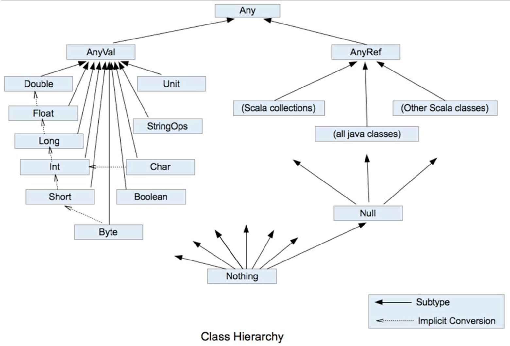
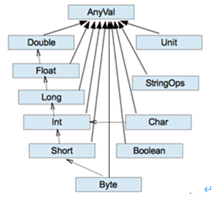

# Scala 入门
## 变量和常量

```scala
var 变量名 [: 变量类型] = 初始值
val 常量名 [: 常量类型] = 初始值
```

1. 声明变量时，类型可以省略，编译器自动推导，即类型推导
2. 类型确定后，就不能修改，说明 scala 是强数据类型语言
3. 变量声明时，必须要有初始值
4. 在声明/定义一个变量时，可以使用var或者val来修饰，var 修饰的变量可改变，val 修饰的变量不可改
5. var修饰的对象引用可以改变，val修饰的对象则不可改变，但对象的状态（值）却是可以改变的。（比如：自定义对象、数组、集合等等）


## 字符串输出
```scala
//（1）字符串，通过 + 号连接
val s1 = name + " " + age
//（2）printf用法字符串，通过 % 传值
printf("name=%s age=%d\n", name, age)
//（3）字符串，通过 $ 引用
val s1 =
    s"""
        |select
        |    name,
        |    age
        |from user
        |where name="$name" and age=${age+2}
    """.stripMargin
```

## 键盘输入
```scala
import scala.io.StdIn
var name = StdIn.readLine()
var age = StdIn.readShort()
var sal = StdIn.readDouble()
```

## 数据类型
### Java 数据类型
1. java 基本类型：char、byte、short、int、long、float、double、boolean
2. java 引用类型：对象类型

由于 java 有基本类型，而且基本类型不是真正意义的对象，即使启面产生了基本类型的包装类，但是仍然存在基本数据类型，所以 java 语言并不是真正意思的面向对象。
java 基本类型的包装类: Character、Byte、Short、Integer、Long、Float、Double、Boolean
注意：java 中基本类型和引用类型没有共同的祖先。

### Scala 数据类型


1. scala 中一切数据都是对象，都是 Any 的子类
2. scala 中数据类型分为两大类：数值类型（AnyVal）、引用类型（AnyRef），不管是值类型还是引用类型都是对象
3. scala 数据类型仍然遵守低精度的值类型向高精度值类型自动转换（隐士转换）
4. scala 中的 StringOps 是对 java 中的 String 增强
5. Unit：表示无值，和其他语言中 void 等同。用作不返回任何结果的方法的结果类型。Unit只有一个实例值，写成 ()。void 不是数据类型，只是一个关键字
6. Null 是一个类型，它只有一个对象 null。 它是所有 AnyRef 类型的子类。Null可以赋值给任意引用类型（AnyRef），但是不能赋值给值类型（AnyVal）
7. Nothing 类型在 Scala 的类层级最低端；它是任何其他类型的子类型。当一个函数，我们确定没有正常的返回值，可以用 Nothing 来指定返回类型，这样有一个好处，就是我们可以把返回的值（异常）赋给其它的函数或者变量（兼容性）

### 整数类型
1. Byte [1]：8位有符号补码整数
2. Short [2]：16位有符号补码整数
3. Int [4]：32位有符号补码整数
4. Long [8]：64位有符号补码整数
5. scala 的整型，默认为 Int 型，声明 Long 型，须后加 ‘l’ 或 ‘L’

### 字符类型
字符类型可以表示单个字符，字符类型是 Char。字符常量是用单引号 ' ' 括起来的单个字符。

### 布尔类型
布尔类型也叫 Booolean 类型数据只允许取值 true 和 false，Booolean 类型占1个字节。

## 类型转换
### 数值类型自动转换
当Scala程序在进行赋值或者运算时，精度小的类型自动转换为精度大的数值类型，这个就是自动类型转换（隐式转换）。



1. 自动提升原则：有多种类型的数据混合运算时，系统首先自动将所有数据转换成精度大的那种数据类型，然后再进行计算
2. 把精度大的数值类型赋值给精度小的数值类型时，就会报错，反之就会进行自动类型转换
3. （byte，short）和char之间不会相互自动转换
4. byte，short，char他们三者可以计算，在计算时首先转换为int类型

### 强制类型转换
1. 将数据由高精度转换为低精度，就需要使用到强制转换
2. 强转符号只针对于最近的操作数有效，往往会使用小括号提升优先级
```scala
var num : Int = 2.7.toInt
```

### 数值类型和String类型间转换
1. 基本类型转String类型（语法：将基本类型的值+"" 即可）
2. String类型转基本数值类型（语法：s1.toInt、s1.toFloat、s1.toDouble、s1.toByte、s1.toLong、s1.toShort）
3. 在将String类型转成基本数值类型时，要确保String类型能够转成有效的数据

```scala
var str1 : String = true + ""
var n1 : Byte = s1.toByte
```

## 运算符
java 中 == 比较两个变量本身的值，即两个对象在内存中的首地址；equals 比较字符串中所包含的内容是否相同。
scala中 == 更加类似于 java 中的 equals

```scala
val s1 = "abc"
val s2 = new String("abc")
s1 == s2  // true
s1.eq(s2)  // false
```

在 scala 中其实是没有运算符的，所有运算符都是方法。
1. 当调用对象的方法时，点.可以省略
2. 如果函数参数只有一个，或者没有参数，() 可以省略

```scala
// 标准的加法运算
val i:Int = 1.+(1)
val j:Int = 1 + (1)
val k:Int = 1 + 1
```

## 流程控制
### 分支控制if-else
1. scala 中 if else 表达式其实是有返回值的，具体返回值取决于满足条件的代码体的最后一行内容
2. 如果大括号{}内的逻辑代码只有一行，大括号可以省略。如果省略大括号，if只对最近的一行逻辑代码起作用

### Switch分支结构
在 scala 中没有 Switch，而是使用模式匹配来处理

### For循环控制
1. for 推导式一行中有多个表达式时，所以要加 ; 来隔断逻辑
2. for 推导式有一个不成文的约定：当for推导式仅包含单一表达式时使用圆括号，当包含多个表达式时，一般每行一个表达式，并用花括号代替圆括号
3. 如果想倒序打印一组数据，可以用reverse
#### 范围数据循环（to）
```scala
for(i <- 1 to 3){
    print(i + " ")
}
```

#### 范围数据循环（until）
```scala
for(i <- 1 until 3) {
    print(i + " ")
}
```

#### 循环守卫
```scala
for(i <- 1 to 3 if i != 2) {
    print(i + " ")
}
```

#### 循环步长
```scala
for (i <- 1 to 10 by 2) {
    println("i=" + i)
}
```

#### 嵌套循环
```scala
for(i <- 1 to 3; j <- 1 to 3) {
    println(" i =" + i + " j = " + j)
}
```

#### 引入变量
```scala
for(i <- 1 to 3; j = 4 - i) {
    println("i=" + i + " j=" + j)
}
```

#### 循环返回值
将遍历过程中处理的结果返回到一个新 Vector 集合中，使用 yield 关键字，开发中很少使用
```scala
val res = for(i <- 1 to 10) yield i
```

#### 倒序打印
```scala
for(i <- 1 to 10 reverse){
    println(i)
}
```

### while 和 do..while 循环控制
与 if 语句不同，while 语句没有返回值，即整个 while 语句的结果是 Unit 类型()。因为 while 中没有返回值，所以当要用该语句来计算并返回结果时，就不可避免的使用变量，而变量需要声明在 while 循环的外部，那么就等同于循环的内部对外部的变量造成了影响，也就违背了函数式编程的重要思想（输入=>函数=>输出，不对外界造成影响），所以不推荐使用，而是推荐使用 for 循环。

### 循环中断
scala 内置控制结构特地去掉了 break 和 continue，是为了更好的适应函数式编程，推荐使用函数式的风格解决 break 和 continue 的功能，而不是一个关键字。scala 中使用 breakable 控制结构来实现 break 和 continue 功能。

```scala
import scala.util.control.Breaks._

def main(args: Array[String]): Unit = {
    breakable {
        for (elem <- 1 to 10) {
            println(elem)
            if (elem == 5) break
        }
    }
}
```