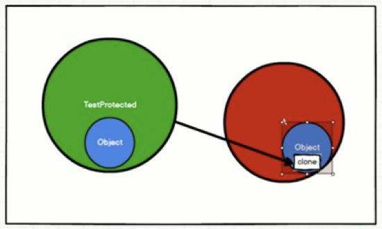

# Scala 入门
## 变量和常量

```scala
var 变量名 [: 变量类型] = 初始值
val 常量名 [: 常量类型] = 初始值
```

1. 声明变量时，类型可以省略，编译器自动推导，即类型推导
2. 类型确定后，就不能修改，说明 scala 是强数据类型语言
3. 变量声明时，必须要有初始值
4. 在声明/定义一个变量时，可以使用var或者val来修饰，var 修饰的变量可改变，val 修饰的变量不可改
5. var修饰的对象引用可以改变，val修饰的对象则不可改变，但对象的状态（值）却是可以改变的。（比如：自定义对象、数组、集合等等）


## 字符串输出
```scala
//（1）字符串，通过 + 号连接
val s1 = name + " " + age
//（2）printf用法字符串，通过 % 传值
printf("name=%s age=%d\n", name, age)
//（3）字符串，通过 $ 引用
val s1 =
    s"""
        |select
        |    name,
        |    age
        |from user
        |where name="$name" and age=${age+2}
    """.stripMargin
```

## 键盘输入
```scala
import scala.io.StdIn
var name = StdIn.readLine()
var age = StdIn.readShort()
var sal = StdIn.readDouble()
```

## 数据类型
### Java 数据类型
1. java 基本类型：char、byte、short、int、long、float、double、boolean
2. java 引用类型：对象类型

由于 java 有基本类型，而且基本类型不是真正意义的对象，即使启面产生了基本类型的包装类，但是仍然存在基本数据类型，所以 java 语言并不是真正意思的面向对象。
java 基本类型的包装类: Character、Byte、Short、Integer、Long、Float、Double、Boolean
注意：java 中基本类型和引用类型没有共同的祖先。

### Scala 数据类型


1. scala 中一切数据都是对象，都是 Any 的子类
2. scala 中数据类型分为两大类：数值类型（AnyVal）、引用类型（AnyRef），不管是值类型还是引用类型都是对象
3. scala 数据类型仍然遵守低精度的值类型向高精度值类型自动转换（隐士转换）
4. scala 中的 StringOps 是对 java 中的 String 增强
5. Unit：表示无值，和其他语言中 void 等同。用作不返回任何结果的方法的结果类型。Unit只有一个实例值，写成 ()。void 不是数据类型，只是一个关键字
6. Null 是一个类型，它只有一个对象 null。 它是所有 AnyRef 类型的子类。Null可以赋值给任意引用类型（AnyRef），但是不能赋值给值类型（AnyVal）
7. Nothing 类型在 Scala 的类层级最低端；它是任何其他类型的子类型。当一个函数，我们确定没有正常的返回值，可以用 Nothing 来指定返回类型，这样有一个好处，就是我们可以把返回的值（异常）赋给其它的函数或者变量（兼容性）

### 整数类型
1. Byte [1]：8位有符号补码整数
2. Short [2]：16位有符号补码整数
3. Int [4]：32位有符号补码整数
4. Long [8]：64位有符号补码整数
5. scala 的整型，默认为 Int 型，声明 Long 型，须后加 ‘l’ 或 ‘L’

### 字符类型
字符类型可以表示单个字符，字符类型是 Char。字符常量是用单引号 ' ' 括起来的单个字符。

### 布尔类型
布尔类型也叫 Booolean 类型数据只允许取值 true 和 false，Booolean 类型占1个字节。

## 类型转换
### 数值类型自动转换
当Scala程序在进行赋值或者运算时，精度小的类型自动转换为精度大的数值类型，这个就是自动类型转换（隐式转换）。


1. 自动提升原则：有多种类型的数据混合运算时，系统首先自动将所有数据转换成精度大的那种数据类型，然后再进行计算
2. 把精度大的数值类型赋值给精度小的数值类型时，就会报错，反之就会进行自动类型转换
3. （byte，short）和char之间不会相互自动转换
4. byte，short，char他们三者可以计算，在计算时首先转换为int类型

### 强制类型转换
1. 将数据由高精度转换为低精度，就需要使用到强制转换
2. 强转符号只针对于最近的操作数有效，往往会使用小括号提升优先级
```scala
var num : Int = 2.7.toInt
```

### 数值类型和String类型间转换
1. 基本类型转String类型（语法：将基本类型的值+"" 即可）
2. String类型转基本数值类型（语法：s1.toInt、s1.toFloat、s1.toDouble、s1.toByte、s1.toLong、s1.toShort）
3. 在将String类型转成基本数值类型时，要确保String类型能够转成有效的数据

```scala
var str1 : String = true + ""
var n1 : Byte = s1.toByte
```

## 运算符
java 中 == 比较两个变量本身的值，即两个对象在内存中的首地址；equals 比较字符串中所包含的内容是否相同。
scala中 == 更加类似于 java 中的 equals

```scala
val s1 = "abc"
val s2 = new String("abc")
s1 == s2  // true
s1.eq(s2)  // false
```

在 scala 中其实是没有运算符的，所有运算符都是方法。
1. 当调用对象的方法时，点.可以省略
2. 如果函数参数只有一个，或者没有参数，() 可以省略

```scala
// 标准的加法运算
val i:Int = 1.+(1)
val j:Int = 1 + (1)
val k:Int = 1 + 1
```

## 流程控制
### 分支控制if-else
1. scala 中 if else 表达式其实是有返回值的，具体返回值取决于满足条件的代码体的最后一行内容
2. 如果大括号{}内的逻辑代码只有一行，大括号可以省略。如果省略大括号，if只对最近的一行逻辑代码起作用

### Switch分支结构
在 scala 中没有 Switch，而是使用模式匹配来处理

### For循环控制
1. for 推导式一行中有多个表达式时，所以要加 ; 来隔断逻辑
2. for 推导式有一个不成文的约定：当for推导式仅包含单一表达式时使用圆括号，当包含多个表达式时，一般每行一个表达式，并用花括号代替圆括号
3. 如果想倒序打印一组数据，可以用reverse
#### 范围数据循环（to）
```scala
for(i <- 1 to 3){
    print(i + " ")
}
```

#### 范围数据循环（until）
```scala
for(i <- 1 until 3) {
    print(i + " ")
}
```

#### 循环守卫
```scala
for(i <- 1 to 3 if i != 2) {
    print(i + " ")
}
```

#### 循环步长
```scala
for (i <- 1 to 10 by 2) {
    println("i=" + i)
}
```

#### 嵌套循环
```scala
for(i <- 1 to 3; j <- 1 to 3) {
    println(" i =" + i + " j = " + j)
}
```

#### 引入变量
```scala
for(i <- 1 to 3; j = 4 - i) {
    println("i=" + i + " j=" + j)
}
```

#### 循环返回值
将遍历过程中处理的结果返回到一个新 Vector 集合中，使用 yield 关键字，开发中很少使用
```scala
val res = for(i <- 1 to 10) yield i
```

#### 倒序打印
```scala
for(i <- 1 to 10 reverse){
    println(i)
}
```

### while 和 do..while 循环控制
与 if 语句不同，while 语句没有返回值，即整个 while 语句的结果是 Unit 类型()。因为 while 中没有返回值，所以当要用该语句来计算并返回结果时，就不可避免的使用变量，而变量需要声明在 while 循环的外部，那么就等同于循环的内部对外部的变量造成了影响，也就违背了函数式编程的重要思想（输入=>函数=>输出，不对外界造成影响），所以不推荐使用，而是推荐使用 for 循环。

### 循环中断
scala 内置控制结构特地去掉了 break 和 continue，是为了更好的适应函数式编程，推荐使用函数式的风格解决 break 和 continue 的功能，而不是一个关键字。scala 中使用 breakable 控制结构来实现 break 和 continue 功能。

```scala
import scala.util.control.Breaks._

def main(args: Array[String]): Unit = {
    breakable {
        for (elem <- 1 to 10) {
            println(elem)
            if (elem == 5) break
        }
    }
}
```


# 函数式编程
面向对象编程：解决问题，分解对象，行为，属性，然后通过对象的关系以及行为的调用来解决问题。对象的本质：对数据和行为的一个封装

函数式编程：解决问题时，将问题分解成一个一个的步骤，将每个步骤进行封装（函数），通过调用这些封装好的步骤，解决问题。函数的本质：函数可以当做一个值进行传递

## 函数基础
### 函数和方法的区别
1. 为完成某一功能的程序语句的集合，称为函数
2. scala 中函数可以嵌套定义
2. 类中的函数称之方法
3. 函数没有重载和重写的概念；方法可以进行重载和重写


### 函数至简原则
1. return 可以省略，scala 会使用函数体的最后一行代码作为返回值；如果有 return，则不能省略返回值类型，必须指定；如果函数明确声明 unit，那么即使函数体中使用 return 关键字也不起作用
2. 如果函数体只有一行代码，可以省略花括号
3. 返回值类型如果能够推断出来，那么可以省略（:和返回值类型一起省略）；scala 如果期望是无返回值类型，可以省略等号
4. 如果函数无参，但是声明了参数列表，那么调用时，小括号，可加可不加；如果函数没有参数列表，那么小括号可以省略，调用时小括号必须省略

```scala
// 可变参数
// 期望是无返回值类型，可以省略等号
def f1(s: String*) {println(s)}

// 省略返回值类型
def f2(i:Int) = i + 1
```

## 函数高级
### 高阶函数
1. 在被调用函数后面加上 _，相当于把函数当成一个整体，传递给变量
```scala
def f(): Int = {
    println("foo...")
    1
}
val f1: () => Int = f _
```

2. 函数可以作为参数进行传递
```scala
// 定义一个函数，函数参数还是一个函数签名
def f1(f: (Int, Int) => Int) = f(2, 4)

// 参数和返回值类型和f1的输入参数一致
def add(a: Int, b: Int) = a + b

// 将add函数作为参数传递给f1函数，如果能够推断出来不是调用，_可以省略
f1(add _) // 6
f1(add) // 6
```

3. 函数可以作为函数返回值返回
```scala
def f1() = {
    def f2() = {}

    f2 _
}

val f = f1()
// 因为f1函数的返回值依然为函数，所以可以变量f可以作为函数继续调用
f()
// 上面的代码可以简化为
f1()()
```

### 匿名函数
匿名函数至简原则
1. 匿名函数如果只有一行，则大括号也可以省略
2. 参数的类型可以省略，会根据形参进行自动的推导
3. 类型省略之后，发现只有一个参数，则圆括号可以省略；其他情况：没有参数和参数超过1的永远不能省略圆括号。
4. 如果参数只出现一次，则参数省略且后面参数可以用 _ 代替，第 n 个 _ 代表第 n 个参数

### 函数柯里化 & 闭包
闭包：如果一个函数，访问到了它的外部（局部）变量的值，那么这个函数和他所处的环境，称为闭包。闭包是函数式编程的标配

函数柯里化：把一个参数列表的多个参数，变成多个参数列表。其实就是将复杂的参数逻辑变得简单化,函数柯里化一定存在闭包
```scala
var a: Int = 10

def f1() = {
    def f2(b: Int) = a + b

    f2 _
}

// 在调用时，f1函数执行完毕后，局部变量a应该随着栈空间释放掉
// 但是在此处，变量a其实并没有释放，而是包含在了f2函数的内部，形成了闭合的效果
val f: Int => Int = f1()

f(3)   // 13
f1()(3)   // 13

// 函数柯里化，其实就是将复杂的参数逻辑变得简单化,函数柯里化一定存在闭包
def f3()(b: Int) = {
    a + b
}

f3()(3) // 13
```

### 控制抽象
控制抽象被描述为是一系列语句的聚集，是一种特殊的函数，因为它是本质上只是对一系列语句的封装。
1. 值调用：把计算后的值传递过去
2. 名调用：把代码传递过去

java 只有值调用；scala 既有值调用，又有名调用
```scala
def myShop(block: () => Unit) {
    println("Welcome in!")
    block()
}

// Welcome in!
// I want a pencil
// 将圆括号替换成花括号只能发生在接收一个参数值的函数上，如果某个函数接收的是两个参数，那么将圆括号改成花括号就会报错
// 圆括号与大括号的区别在于可以传递的代码量而已。圆括号只能传递一条语句，而大括号可以传递多条语句
myShop {
    () => println("I want a pencil")
}
```

```scala
// 可以理解为省略空参列表的简写方式
def myShop(block: => Unit) {
    println("Welcome in!")
    block
}

// Welcome in!
// I want a condom
myShop( println("I wanna buy a condom") )
```

### 惰性函数
当函数返回值被声明为lazy时，函数的执行将被推迟，直到我们首次对此取值，该函数才会执行。


# 面向对象
## Scala包
### 包说明
一个源文件中可以声明多个package，包名叠加。包名可以采用对象的方式嵌套（父子包），可以在包名的后面增加{}，表示作用域。其中{}里面可以声明包和类（无法声明属性和方法），子包访问父包无需导包
```scala
package com {
    import com.atguigu.Inner //父包访问子包需要导包
    object Outer {
        val out: String = "out"
        def main(args: Array[String]): Unit = {
            println(Inner.in)
        }
    }

    package atguigu {
        object Inner {
            val in: String = "in"
            def main(args: Array[String]): Unit = {
                println(Outer.out) //子包访问父包无需导包
            }
        }
    }
}
```

### 包对象
包中无法声明属性和方法，scala提供了包对象的概率，可以声明属性和方法。在Scala中可以为每个包定义一个同名的包对象，定义在包对象中的成员，作为其对应包下所有class和object的共享变量，可以被直接访问。
```scala
package object com{
	val shareValue="share"
	def shareMethod()={}
}
```

### 导包说明
1. 方法区内存溢出：加载了大量的类
2. 堆内存溢出：垃圾回收器回收对象之后，还没有足够的内存分配对象
3. 栈内存溢出：没有足够的内存来分配这个栈空间。java 中来一个线程会给一个栈内存，线程很多的情况下，栈会很多，栈就有可能分配不了，会导致栈内存溢出
4. 递归调用会出现栈溢出 StackOverflow（滚动条），压栈次数不够（里面的小格子不够）

```scala
import java.util._  // 导入包中所有的类
import java.util.{ArrayList=>JL}    // 给类起名
import java.util.{ArrayList =>_,_}  // 屏蔽类
import java.util.{HashSet, ArrayList}   // 导入多个类
```

scala中的三个默认导入分别是
```scala
import java.lang._
import scala._
import scala.Predef._
```

### 访问权限
1. scala 中属性和方法的默认访问权限为 public，但 scala 中无 public 关键字
2. private 为私有权限，只在类的内部和伴生对象中可用
3. protected 为受保护权限，scala 中受保护权限比 java 中更严格，同类、子类可以访问，同包无法访问（和 java 区别）
4. private[包名] 增加包访问权限，包名下的其他类也可以使用

```java
public class TestProtected {
    public static void main(String[] args) throws Exception {
        A a = new A();
        a.clone();	// 为什么子类 TestProtected 无法访问父类 Object 中的 clone() ?
    }
}

class A {
}
```
1. 一个类继父类所有内容（包括私有），访问权限表示你能不能用，和有没有没关系
2. 子类可以代替父类出现（因为子类包含父类内存中所有内容）
3. 访问权限：方法的提供者和方法的调用者之间的关系
4. “.” 表示从属关系，user.name = 用户中 的name 属性
5. 方法的提供者：java.lang.Object
6. 方法的调用者：com.atguigu.bigdata.java.TestProtected

```java
public class TestProtected {
    public static void main(String[] args) throws Exception {
        A a = new A();
        a.clone();	// A中重写clone()方法，为什么能访问 ？
    }
}

class A {
    @Override
    protected Object clone() throws CloneNotSupportedException {
        return super.clone();
    }
}
```
1. 方法的提供者：com.atguigu.bigdata.java.A
2. 方法的调用者：com.atguigu.bigdata.java.TestProtected
3. A中重写clone()方法，clone()的提供者就发生改变，提供者和调用者属于同包，可以访问


## 类和对象
静态和类有关系，和对象无关。Scala中没有静态，Scala是一个完全面向对象的语言
```java
Thread t1 = new Thread();
Thread t2 = new Thread();

t1.start();
t2.start();

t1.sleep(1000); // Thread static method
t2.wait();  // Object member method
```
1. sleep() 不会让 t1 对象休眠，和它无关。正确写法：Thread.sleep(1000)，让当前正在运行的线程休眠，如果是在 main 方法中调用，则是主线程休眠
2. wait() 是一个成员方法，和对象相关，意味着和 t2 有关系，则 t2 等待

### 类
1. scala 语法中，类并不声明为 public，所有这些类都具有公有可见性（即默认就是 public）
2. 一个 scala 源文件可以包含多个类

### 属性
java 中的 String 是不可变字符串，s.strim()会产生新的字符串，对原来的字符串没有任何影响。
```java
public final class String{
    private final char value[];
}
```
1. 引用类型的值是内存地址，final修饰之后无法改变，内容可变。不可变字符串中的不可变指的是内存地址
2. 但是 String 没有提供任何的方法来改变它的内容，所以它的所有方法是产生新的字符串，例如replace()、substring()
3. 为了满足 bean 规范，使用注解 @BeanProperty 给 bean 增加 set、get 方法
```scala
// 基本语法
[修饰符] var|val 属性名称 [：类型] = 属性值
```
1. 类声明的属性，其实编译成字节码文件时，声明私有的属性。同时，scala编译器会给属性生成两个公共访问的方法（类似set、get）
2. 如果使用 val 声明类的属性，会给这个属性同时增加 final，不会在编译时产生属性对应的 set 方法
3. 类的属性如果声明为private，那么对应的set、get方法也是私有的
4. scala 中访问对象的属性，其实不是访问属性，而是属性对应的方法。调用属性等同于调用属性的 get 方法、给属性赋值等同于调用属性的 set 方法
5. Bean 属性（@BeanProperty），可以自动生成规范的 setXxx/getXxx 方法

### 方法
#### 重写
```java
public class Test {
    public static void main(String[] args) {
        A a = new B();
        a.getSum();	// 30
    }
}

class A {
    public int i = 10;

    public int getSum() {
        return getI() + 10;
    }

    public int getI() {
        return i;
    }
}

class B extends A {
    public int i = 20;

    public int getI() {
        return i;
    }
}
```
1. 多态：子类重写父类方法
2. 调用的原则：动态绑定机制
3. 调用对象的成员方法时（无论是直接调用还是间接调用，只要调用成员方法），会将方法和当前对象的实际内存进行绑定，然后调用。动态绑定机制和属性无关，意味着看属性的时候不会看实际内存（变量在哪声明在哪使用，属性不是动态绑定的）

#### 重载
```java
public class TestProtected {
    public static void main(String[] args) {
        A a = new B();
        testA(a);   // A
    }

    public static void testA(A a) {
        System.out.println('A');
    }

    public static void testA(B b) {
        System.out.println('B');
    }
}

class A {
}

class B extends A {
}
```
1. 重载：参数列表不相同：参数个数、参数顺序、参数类型
2. 不看实际内存，只看参数类型

### 创建对象
```scala
val | var 对象名 [：类型]  = new 类型()
```
1. scala构造方法如果无参，可以省略小括号
2. val 修饰对象，不能改变对象的引用（即：内存地址），可以改变对象属性的值
3. var修饰对象，可以修改对象的引用和修改对象的属性值

### 构造器
scala 类的构造器包括：主构造器和辅助构造器

类也是函数，可以在类名后加 ()。类名后如果加 ()，表示的就是主构造方法。{} 里面的内容就是构造方法体，构造对象的时候，里面的代码都可以执行
```scala
class 类名(形参列表) {  // 主构造器
   // 类体
   def  this(形参列表) {  //辅助构造器可以有多个...
   }
} 
```
1. 辅助构造器，函数的名称 this，可以有多个，编译器通过参数的个数来区分
2. 辅助构造方法不能直接构建对象，必须直接或者间接调用主构造方法
3. 构造器调用其他另外的构造器，要求被调用构造器必须提前声明

### 构造器参数
scala类的主构造器函数的形参包括三种类型：未用任何修饰、var修饰、val修饰
1. 未用任何修饰符修饰，这个参数就是一个局部变量
2. var修饰参数，作为类的成员属性使用，可以修改
3. val修饰参数，作为类只读属性使用，不能修改
```scala
object Test extends App {
    // A
    // B
    // B this
    new B()
}

class A(var s: String) {
    println("A")

    def this() {
        this("")
        println("A this")
    }
}

class B(s: String) extends A(s) {
    println("B")

    def this() {
        this("")
        println("B this")
    }
}
```

```scala
object Test extends App {
    // A
    // A this
    // B
    // B this
    new B()
}

class A(var s: String) {
    println("A")

    def this() {
        this("")
        println("A this")
    }
}

class B(s: String) extends A {
    println("B")

    def this() {
        this("")
        println("B this")
    }
}
```
